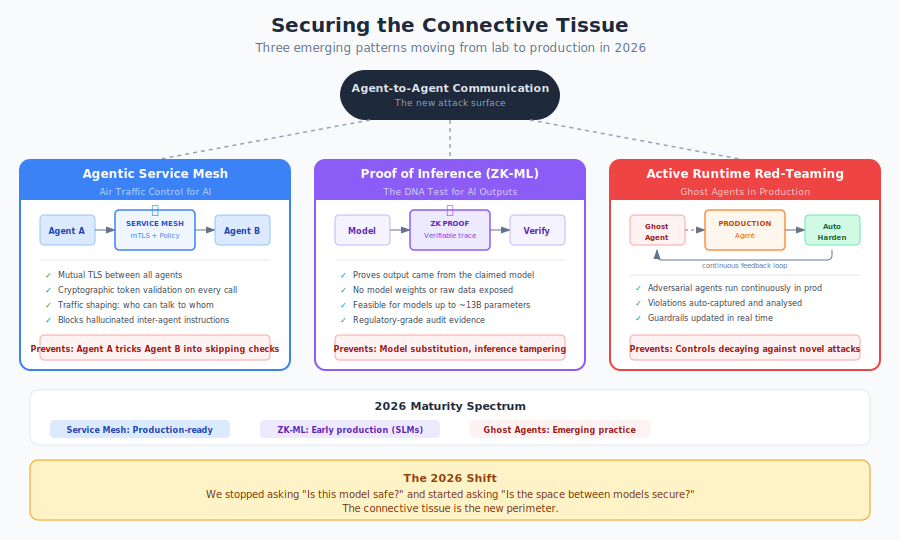

# Securing the Connective Tissue

**The runtime security landscape in 2026 has shifted from securing models to securing the space between them.**

{ .arch-diagram }

For three years, AI security focused on the model: align it, constrain it, monitor its outputs. That work remains essential. But as enterprises deploy multi-agent systems where dozens of models coordinate, delegate, and act on each other's outputs, a new reality has emerged. The most dangerous attack surface is no longer inside any single model. It is the connective tissue between them: the calls, the handoffs, the trust assumptions, and the invisible wiring that lets one agent tell another what to do.

Three patterns are moving from research to production to address this. Each solves a different piece of the problem, and together they represent a structural shift in how runtime security works.

## 1. The Agentic Service Mesh

**Air Traffic Control for your AI swarm.**

### The problem it solves

In a multi-agent system, agents talk to each other. A "Customer Support Agent" might tell a "Wire Transfer Agent" to initiate a payment. A "Research Agent" might instruct a "Code Execution Agent" to run a script. These inter-agent instructions look identical to legitimate delegations, even when they are hallucinated, injected, or the product of a compromised upstream agent.

The framework's existing controls address pieces of this. [Delegation chains](../infrastructure/agentic/delegation-chains.md) (DEL-01 through DEL-05) enforce authorization and depth limits. [Tool access controls](../infrastructure/agentic/tool-access-controls.md) (TOOL-01 through TOOL-06) constrain what tools agents can invoke. [Network segmentation](../infrastructure/controls/network-and-segmentation.md) (NET-01 through NET-08) isolates traffic zones. But these controls operate at individual boundaries. They do not provide a unified control plane that intercepts, authenticates, and authorises every interaction between agents as a single, observable system.

That is what the agentic service mesh provides.

### What it is

The same architectural pattern that microservices needed Istio and Envoy to manage communication. A dedicated infrastructure layer that intercepts every interaction between agents, enforces policy at the transport level, and provides complete observability over inter-agent traffic.

The core capabilities:

**Mutual TLS for agents.** Every agent-to-agent call is encrypted and mutually authenticated. Agent B cryptographically verifies that the instruction came from Agent A, not from a prompt injection masquerading as Agent A. This is not application-level trust ("the message says it's from Agent A"). It is transport-level proof.

**Cryptographic token validation.** Beyond identity, the mesh enforces that inter-agent requests carry valid, non-expired, scope-limited tokens. A policy might state: "Agent B (Money Mover) can only accept instructions from Agent A (Authenticator) if the request contains a valid token proving the user completed identity verification within the last 60 seconds." No token, no action.

**Traffic shaping for logic.** The mesh defines and enforces communication topologies. Not every agent should be able to talk to every other agent. A research agent has no business instructing a payment agent. The mesh encodes these constraints as infrastructure policy, not as instructions in system prompts that the model might ignore.

**Blocking hallucinated instructions.** When a model hallucinates a delegation (inventing a tool call or agent instruction that should not exist), the mesh rejects it before it reaches the target. The instruction never arrives, so there is nothing for the receiving agent to misinterpret.

### How it maps to the framework

The agentic service mesh is the infrastructure-level implementation of controls that the framework currently defines at the application level:

| Framework Control | Current Implementation | With Service Mesh |
|------------------|----------------------|-------------------|
| DEL-01 Explicit authorization | Application-level policy check | Transport-level mTLS + token validation |
| DEL-02 Privilege constraints | System prompt instructions | Mesh-enforced communication topology |
| DEL-04 Depth limits | Counter in agent context | Mesh rejects calls exceeding depth |
| TOOL-02 Gateway enforcement | Application middleware | Mesh sidecar intercepts at network level |
| NET-05 Agent egress restrictions | Firewall rules | Mesh-native egress policy per agent identity |
| IA-02 Agent identity | Application-issued credentials | Cryptographic identity with certificate rotation |

The key shift: from "tell the agent not to do this" to "make it architecturally impossible for the agent to do this." This aligns with the framework's core principle that [infrastructure beats instructions](infrastructure-beats-instructions.md).

### Maturity

Production-ready for structured multi-agent deployments. Organisations running Kubernetes-based agent orchestration can adapt existing service mesh infrastructure (Istio, Linkerd) with agent-specific policy extensions. Purpose-built agentic mesh platforms are emerging but early.

## 2. Proof of Inference (ZK-ML)

**The DNA test for AI outputs.**

### The problem it solves

As organisations consume third-party AI models (a specialised credit-scoring model, a medical diagnosis assistant, a compliance checker), they face a trust gap. How do you know the output you received actually came from the model you contracted for? How do you know it was not tampered with by a compromised intermediary, or quietly substituted with a cheaper, less capable model?

The framework's [verification gap](the-verification-gap.md) analysis identifies this problem clearly: no current mainstream approach independently verifies whether an output is *actually* from the claimed model running the claimed computation. Hash-based supply chain controls (SUP-01 through SUP-03) verify model identity at deployment time, but they cannot prove that a specific inference was performed by a specific model at a specific time.

Zero-Knowledge Machine Learning (ZK-ML) closes this gap.

### What it is

A cryptographic technique that generates a mathematical proof that a specific inference was executed on a specific model, without revealing the model's weights or the input data. The proof is compact, independently verifiable, and tamper-evident.

**How it works, simply:** The model provider runs the inference and simultaneously generates a zero-knowledge proof. The proof attests: "This output was produced by running this input through a model with these specific properties." The consumer (or a regulator, or an auditor) can verify the proof in seconds without seeing the model internals or the raw data.

**The 2026 breakthrough:** Proof generation for models up to approximately 13 billion parameters is now feasible in under 15 minutes. This covers the majority of specialised, task-specific models that enterprises deploy for high-stakes decisions (credit scoring, medical triage, compliance classification). It does not yet cover frontier models (100B+ parameters), but the trajectory is clear.

### The regulated use case

Consider a bank using a third-party credit-scoring model. The regulator asks: "Prove that the model that scored this applicant was the audited, bias-tested model you certified, not a cheaper substitute or a modified version."

Without ZK-ML, the bank can show deployment logs, configuration records, and API call metadata. All of these can be fabricated. With ZK-ML, the bank presents a cryptographic proof that the specific inference was executed by the specific model. The proof is mathematically verifiable. It does not require trusting the bank's internal records.

This is also the regulatory "right to explanation" made technically enforceable. You can prove to a regulator that your loan approval agent followed a specific logic path without revealing proprietary model weights or the applicant's raw data.

### How it maps to the framework

| Framework Control | Current Approach | With ZK-ML |
|------------------|-----------------|------------|
| SUP-01 Model provenance | Hash-based identity at deploy time | Cryptographic proof per inference |
| The verification gap | LLM-based checks (correlated failures) | Fully independent mathematical proof |
| LOG-07 Log integrity | Append-only, tamper-evident storage | Proof of computation integrity, not just log integrity |
| Judge assurance | Cross-validation, human sampling | Proof that the judge model ran the claimed evaluation |

### Limitations

**Scale.** 13B parameters is the current practical ceiling. Frontier models (GPT-4 class, Claude class) exceed this by an order of magnitude. Proof generation for these remains computationally prohibitive, though research is actively compressing the gap.

**Latency.** Proof generation adds minutes, not milliseconds. This makes ZK-ML unsuitable for inline, real-time verification. It works for async verification (post-inference audit) and periodic attestation, not for blocking decisions.

**Adoption.** ZK-ML requires model providers to integrate proof generation into their serving infrastructure. Until major providers adopt this, the pattern is limited to self-hosted models and cooperative third-party providers.

### Maturity

Early production for specialised small-to-mid-size models (credit scoring, medical classification, compliance). Research-stage for frontier models. The VAP (Verifiable AI Provenance) framework is building standardisation around this, with IETF draft submissions planned and ISO engagement targeted for 2026.

## 3. Active Red-Teaming at Runtime

**Ghost agents that hunt your production systems, continuously.**

### The problem it solves

Red-teaming has traditionally been a periodic exercise. A specialist team (internal or external) spends two weeks probing your AI systems, produces a report, and leaves. The organisation fixes the findings and waits for the next engagement. Meanwhile, models update, configurations change, new agents are deployed, and the attack surface shifts underneath.

The framework's [red team playbook](../maso/red-team/red-team-playbook.md) provides structured scenarios (RT-01 through RT-13+) mapped to OWASP risks and MASO controls. It recommends testing frequencies: every deployment for Tier 1, monthly for Tier 2, quarterly for Tier 3. This is sound, but it is inherently backward-looking. You test against known attack patterns. The gap between tests is a window of exposure.

In 2026, red-teaming has become a continuous, automated, runtime process.

### What it is

**Ghost agents** are adversarial AI agents deployed inside your production environment whose sole purpose is to break your other agents. They probe for policy violations, test guardrail boundaries, attempt injection attacks, and try to manipulate inter-agent trust relationships. They run continuously, not periodically.

The architecture has three components:

**The ghost agents themselves.** Specialised adversarial models trained or prompted to find weaknesses in your production agents. They do not serve users. They exist only to attack. They operate within controlled blast-radius boundaries (they can probe, but infrastructure controls prevent actual data exfiltration or financial transactions).

**The detection harness.** When a ghost agent successfully triggers a policy violation (a guardrail miss, a privilege escalation, a data leak in a sandboxed environment), the harness captures the full interaction state: the attack vector, the failing control, the system configuration at the time of failure.

**The feedback loop.** This is the critical innovation. Captured failures feed directly into guardrail updates, judge criteria refinement, and (where the judge is a distilled SLM) model retraining data. The system hardens itself. A plane that automatically strengthens its own hull the moment it detects a microscopic stress fracture.

### How it maps to the framework

| Framework Element | Current Approach | With Ghost Agents |
|------------------|-----------------|-------------------|
| Red team playbook (RT-01+) | Periodic manual/automated testing | Continuous automated adversarial probing |
| LOG-06 Injection detection | Pattern matching + guardrail scoring | Live adversarial injection with immediate feedback |
| LOG-05 Drift detection | Statistical baseline comparison | Active probing detects drift in real time |
| Guardrail improvement | Manual rule updates after incidents | Automated rule generation from captured failures |
| Judge criteria | Manual refinement after review | Criteria updated from ghost agent findings |
| PACE resilience | Triggered by operational metrics | Ghost agent failures can trigger PACE transitions |

### The feedback loop in detail

```text
Ghost Agent probes production agent
  → Production agent responds
    → Response violates policy?
      → NO: Ghost Agent tries new vector
      → YES: Harness captures full state
        → Attack vector added to guardrail rules
        → Judge criteria updated with new pattern
        → SLM retraining data enriched
        → Guardrails redeployed (automated or gated)
        → Ghost Agent re-tests with updated controls
```

This creates a continuous hardening cycle. The attack surface that existed yesterday is smaller today, because yesterday's successful ghost agent attack is today's blocked pattern.

### Operational boundaries

Ghost agents in production raise legitimate concerns. Boundaries matter:

- **Blast radius control.** Ghost agents operate within sandboxed boundaries. They can trigger policy violations in the detection harness, but infrastructure controls prevent them from executing real financial transactions, accessing real customer data, or causing real-world harm. The [sandbox patterns](../infrastructure/agentic/sandbox-patterns.md) (SAND-01 through SAND-06) apply to ghost agents as much as to production agents.
- **Distinguishability.** Ghost agent traffic is tagged and routable to separate analysis pipelines. It must not contaminate production metrics, billing, or customer-facing analytics.
- **Escalation.** When ghost agents discover critical vulnerabilities (a complete guardrail bypass, a privilege escalation path), the finding is escalated to human review before automated remediation. Not every fix should be automated. Some findings require architectural changes.

### Maturity

Emerging practice. Organisations with mature AI security programmes are deploying ghost agents in staged environments and selectively in production. The tooling is early: most implementations are custom-built using adversarial prompt libraries and automated harnesses. Standardised platforms are forming but not yet widely available.

## Where These Three Intersect

These patterns are complementary, not competing:

| Scenario | Service Mesh | ZK-ML | Ghost Agents |
|----------|-------------|-------|-------------|
| Agent A sends a forged instruction to Agent B | **Blocks it** (mTLS + token validation) | Proves the instruction did not originate from a verified inference | Ghost agent tests this attack vector continuously |
| Third-party model is quietly substituted | Mesh logs the model endpoint change | **Proves substitution** (inference proof fails verification) | Ghost agent probes third-party model for unexpected behaviour changes |
| Guardrail rule becomes stale against new attack | Mesh enforces transport-level policy regardless | Irrelevant (guardrails, not inference) | **Discovers the gap** and feeds new rule to guardrails |
| Regulatory audit demands explanation | Mesh provides full inter-agent communication log | **Provides cryptographic proof** of computation | Provides evidence that controls were continuously tested |

Together, they form a defence posture where the connective tissue is as controlled and observable as the models themselves.

## Implications for the Framework

These three patterns extend, rather than replace, the existing control architecture:

1. **The agentic service mesh is the infrastructure-level implementation of delegation and tool access controls.** It moves these controls from the application layer (where models can ignore them) to the transport layer (where they cannot). This is the natural evolution of [infrastructure beats instructions](infrastructure-beats-instructions.md) for multi-agent environments.

2. **ZK-ML fills the verification gap for third-party model trust.** It provides the first fully independent, mathematically verifiable proof of inference that does not rely on LLM reasoning. For the [verification spectrum](the-verification-gap.md), it sits at maximum independence.

3. **Ghost agents make the red team playbook continuous.** They transform red-teaming from a periodic assessment into a runtime control that produces its own training data for guardrail and judge improvement. Combined with [distilled SLM judges](../extensions/technical/distill-judge-slm.md), this creates a self-improving detection layer.

## Key Takeaways

1. **The attack surface has shifted.** Securing individual models is necessary but insufficient. The connective tissue between agents, the inter-agent communication, delegation paths, and trust assumptions, is the new perimeter.

2. **The agentic service mesh enforces trust at the transport layer.** Mutual TLS, cryptographic token validation, and traffic shaping make it architecturally impossible for agents to act on hallucinated or forged instructions. This is Air Traffic Control for your AI swarm.

3. **Proof of inference (ZK-ML) closes the trust gap for third-party models.** Cryptographic proofs verify that a specific output came from a specific model, without exposing weights or data. Currently feasible for models up to ~13B parameters.

4. **Ghost agents make red-teaming continuous and self-healing.** Adversarial agents probe production systems in real time, capture failures, and feed them directly into guardrail and judge improvements. The system hardens itself.

5. **These patterns are complementary.** The mesh controls communication, ZK-ML proves computation, and ghost agents stress-test the whole system. Together, they secure the connective tissue that 2026 multi-agent systems depend on.

## Related

- [When Agents Talk to Agents](when-agents-talk-to-agents.md)
- [The Orchestrator Problem](the-orchestrator-problem.md)
- [The Verification Gap](the-verification-gap.md)
- [Infrastructure Beats Instructions](infrastructure-beats-instructions.md)
- [Delegation Chains](../infrastructure/agentic/delegation-chains.md)
- [Tool Access Controls](../infrastructure/agentic/tool-access-controls.md)
- [Network & Segmentation](../infrastructure/controls/network-and-segmentation.md)
- [Red Team Playbook](../maso/red-team/red-team-playbook.md)
- [Distilling the Judge into an SLM](../extensions/technical/distill-judge-slm.md)

!!! info "References"
    - [Istio Service Mesh](https://istio.io/)
    - [ZK-ML: Zero-Knowledge Proofs for Machine Learning](https://zkml.io/)
    - [VAP: Verifiable AI Provenance Framework](https://veritaschain.org/vap/)
    - [ZEN Framework (NDSS 2026)](https://techxplore.com/news/2026-03-ai-zen-framework-black.html)
    - [Narajala et al.: Zero-Trust Identity Framework for Agentic AI (May 2025)](https://arxiv.org/abs/2505.19301)
    - [OWASP Top 10 for LLM Applications 2025](https://owasp.org/www-project-top-10-for-large-language-model-applications/)
    - [Cooperative AI Foundation: Multi-Agent Risks (2025)](https://arxiv.org/abs/2502.14143)
